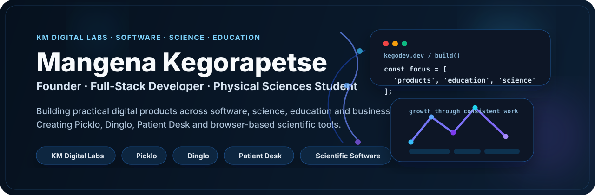
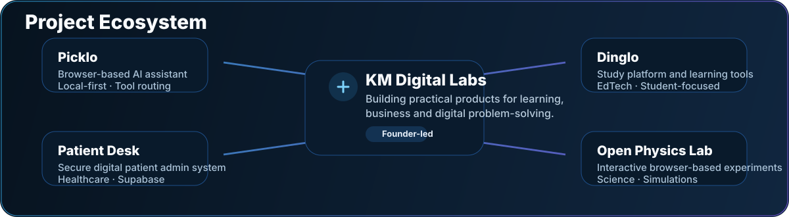
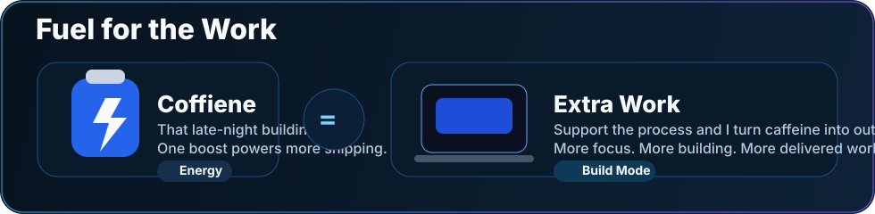

 

&nbsp;
<a href="https://www.instagram.com/kmdigitallabs/"><strong>@kmdigitallabs</strong></a>
&nbsp;&nbsp;&nbsp;&nbsp;

&nbsp;
<a href="https://kmdigitallabs.co.za"><strong>kmdigitallabs.co.za</strong></a>

  

---

## About Me

- Founder of **KM Digital Labs**
- Full-stack developer focused on practical web products and digital systems
- Building **Picklo**, **Dinglo**, **Patient Desk** and browser-based scientific tools
- Physical Sciences student with interests in **Biochemistry and Chemistry**
- Interested in **EdTech, scientific software, AI-assisted systems and full-stack development**

---

## Tech Stack

  

---

## Project Ecosystem

  

---

## Featured Projects

<table>
<tr>
<td width="50%" valign="top">

### [Picklo](https://github.com/kegodev/picklo)

A browser-based AI assistant focused on local-first functionality, safe tool routing, memory and file handling.

`JavaScript` · `AI` · `Local-first`

[Explore Project](https://github.com/kegodev/picklo)

</td>
<td width="50%" valign="top">

### [Dinglo Open Physics Lab](https://github.com/kegodev/open-physics-lab)

Interactive browser-based physics simulations designed for learning, experimentation and science education.

`JavaScript` · `Physics` · `EdTech`

[Launch Lab](https://kegodev.github.io/open-physics-lab/) · [Source](https://github.com/kegodev/open-physics-lab)

</td>
</tr>
<tr>
<td width="50%" valign="top">

### [Patient Desk](https://github.com/kegodev/patient-desk)

A secure digital patient-administration system for medical practices with Supabase Auth, RLS and encrypted patient content.

`JavaScript` · `Supabase` · `Healthcare`

[View Repository](https://github.com/kegodev/patient-desk)

</td>
<td width="50%" valign="top">

### [Biochemistry Labs](https://github.com/kegodev/biochemistry-labs)

Interactive biochemistry tools and laboratory-focused utilities for science learning and analysis.

`JavaScript` · `Biochemistry` · `Scientific Software`

[View Repository](https://github.com/kegodev/biochemistry-labs)

</td>
</tr>
</table>

---

## Fuel for the Work

  

---

## GitHub Activity

  

---

## What I Build Around

`EdTech` · `Scientific Software` · `Virtual Labs` · `AI Systems` · `Full-Stack Applications` · `Business Software`

---

### KM Digital Labs

**Build useful products. Solve real problems. Keep improving.**

